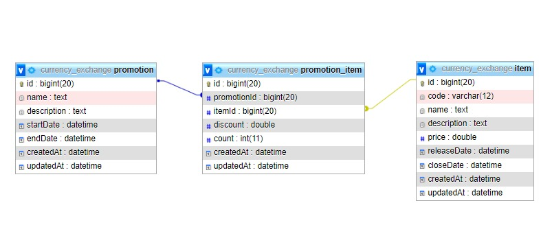

# Table of content
- [Table of content](#table-of-content)
- [Problem](#problem)
- [Solution](#solution)
  - [Entity Relationship Diagram](#entity-relationship-diagram)
  - [ทำไมถึงออกแบบในลักษณะนี้?](#ทำไมถึงออกแบบในลักษณะนี้)
  - [รายละเอียดแต่ละ field ในตาราง](#รายละเอียดแต่ละ-field-ในตาราง)
  - [Code](#code)

# Problem
  "คุณได้รับมอบหมายให้ออกแบบ Database ของระบบขาย code item สำหรับเกมต่างๆ ซึ่งคอยให้บริการแก่ลูกค้าที่ต้องการเข้ามาซื้อ code ไปเติมในเกม" 

  **ตามรายละเอียดดังนี้**
  - item ที่ขายจะต้องมี ชื่อสินค้า, รายละเอียดสินค้า, ราคาขาย, วันที่เปิดขาย, วันที่เลิกขาย
  - เมื่อลูกค้าซื้อ Item แล้วจะได้รับเป็น code (โดย code อาจถูกบันทึกไว้ล่วงหน้า หรือ อาจถูกสร้างหลังจากซื้อ ก็ได้)
  - item สามารถจัดโปรโมชั่นลดราคาในช่วงเวลาที่กำหนดได้ เช่น ปกติ ราคา 150 บาท จัดโปรเดือนมกราคม ลดราคาเป็น 100 บาท
  
  **Bonus**
  - item อาจถูกขายแบบ Bundle เช่น ขาย สกินตัวละครพร้อมกันสองตัวในราคาพิเศษ  หรือขาย กล่องสุ่มไอเท็ม 5 กล่อง ในราคาถูกกว่าปกติ

# Solution
## Entity Relationship Diagram

  


## ทำไมถึงออกแบบในลักษณะนี้?

จาก ER Diagram ด้านบนจะเห็นได้ว่ามีตารางที่ถูกออกแบบมา 3 ตาราง โดยตาราง promotion และ item นั้นจะเก็บข้อมูลทั่วไปของโปรโมชั่นและสินค้า ซึ่งเก็บในลักษณะปกติ แต่สิ่งที่น่าสนใจคือตาราง promotion_item ซึ่งมีไว้เพื่อจับคู่ระหว่างโปรโมชั่นและสินค้า ที่ออกแบบให้ตารางออกมาจับคู่กันในลักษณะนี้เพราะว่าจะสามารถทำให้มีการสร้างโปรโมชั่นแบบ Bundle หรือลดราคาสินค้าเมื่อซื้อสินค้าหลายชิ้นได้ โดยที่มานั้นคือหากเราต้องการคิดส่วนลดสินค้าที่มากกว่า 1 ชิ้น จะทำให้ลักษณะความสัมพันธ์ของ item กับ promotion เป็น many-to-many การจับคู่ออกมาในรูปแบบนี้จะช่วยแก้ปัญหานี้ได้ ยกตัวอย่างเหตุการณ์เพื่อให้เห็นภาพมากขึ้นได้ดังนี้
- **กรณีที่ 1:** ลดราคาสินค้าชิ้นเดียว 
  - ในกรณีนี้การเก็บข้อมูลในตาราง promotion_item นั้นจะเก็บเป็น itemId คู่กับ promotionId โดยระบุส่วนลดเข้าไปที่ discount และระบุจำนวนสินค้าเป็น 1 ที่ count และเป็นจำนวน 1 row
- **กรณีที่ 2:** ลดราคาสินค้าแบบเดียวกันเมื่อซื้อหลายชิ้น
  - ในกรณีนี้จะเก็บข้อมูลคล้ายกันกับในกรณีที่ 1 แต่จะระบุจำนวนสินค้ามากกว่า 1 ชิ้น และระบุส่วนลดจากราคารวมของจำนวนสินค้าระบุไว้ก่อนหน้านี้ เช่น โปรโมชั่นลดราคาเมื่อซื้อโค้ดเสื้อพรีเมี่ยม 5 โค้ดลดทันที่ 100 บาท ก็จะเก็บ count = 5 และ discount = 100
- **กรณีที่ 3:** ลดราคาสินค้าเมื่อซื้อเป็นเซตหรือซื้อคู่
  - ในกรณีนี้จะค่อนข้างพิเศษกว่ากรณีอื่น ๆ เนื่องจากจะมีข้อมูลที่เป็นรหัสโปรโมชั่นเดียวกันถูกเก็บซ้ำอยู่ด้วย เช่น ถ้าหากมีโปรโมชั่นซื้อโค้ดเสื้อเศรษฐีคู่กับโค้ดกางเกงเศรษฐี รับส่วนลดทันทีโค้ดละ 30 บาท ก็จะได้ข้อมูลที่เก็บมาเป็น 2 row โดยส่วนแรกจะเก็บเป็นข้อมูลของเสื้อเศรษฐีซึ่ง count=1 และ discount=30 และอีกส่วนจะเก็บข้อมูลของกางเกงเศรษฐีที่ count=1 และ discount=30

## รายละเอียดแต่ละ field ในตาราง
- **promotion** : ตารางเก็บช้อมูลโปรโมชั่น

    | field       | type       | description               |
    |-------------|------------|---------------------------|
    | id          | bigint(20) | รหัสเลขสำหรับระบุข้อมูลโปรโมชั่น |
    | name        | text       | ชื่อของโปรโมชั่น              |
    | description | text       | คำอธิายโปรโมชั่น             |
    | startDate   | datetime   | วันเริ่มต้นโปรโมชั่น            |
    | endDate     | datetime   | วันหมดโปรโมชั่น              |
    | createdAt   | datetime   | วันที่สร้างข้อมูล               |
    | updatedAt   | datetime   | วันที่เปลี่ยนแปลงข้อมูลล่าสุด      |


- **item**: ตารางเก็บข้อมูลสินค้า

    | field       | type        | description            |
    |-------------|-------------|------------------------|
    | id          | bigint(20)  | รหัสเลขสำหรับระบุข้อมูลสินค้า |
    | code        | varchar(12) | โค้ดประจำสินค้า           |
    | name        | text        | ชื่อสินค้า                 |
    | description | text        | คำอธิายสินค้า             |
    | price       | double      | ราคาสินค้า               |
    | releaseDate | datetime    | วันที่เริ่มวางจำหน่ายสินค้า    |
    | closeDate   | datetime    | วันที่เลิกจำหน่ายสินค้า       |
    | createdAt   | datetime    | วันที่สร้างข้อมูล            |
    | updatedAt   | datetime    | วันที่เปลี่ยนแปลงข้อมูลล่าสุด   |

- **promotion_item**: ตารางจับคู่สินค้ากับโปรโมชั่น

    | field       | type        | description            |
    |-------------|-------------|------------------------|
    | id          | bigint(20)  | รหัสเลขสำหรับระบุข้อมูลสินค้า |
    | code        | varchar(12) | โค้ดประจำสินค้า           |
    | name        | text        | ชื่อสินค้า                 |
    | description | text        | คำอธิายสินค้่า             |
    | price       | double      | ราคาสินค้า               |
    | releaseDate | datetime    | วันที่เริ่มวางจำหน่ายสินค้า    |
    | closeDate   | datetime    | วันที่เลิกจำหน่ายสินค้า       |
    | createdAt   | datetime    | วันที่สร้างข้อมูล            |
    | updatedAt   | datetime    | วันที่เปลี่ยนแปลงข้อมูลล่าสุด   |

## Code
[see as javascript file.](./sequelize.model.js)

  ```js
  // Item model
    const Item = sequelize.define(
    "item",
    {
        id: {
        type: Sequelize.BIGINT,
        primaryKey: true,
        autoIncrement: true,
        },
        code: {
        type: Sequelize.STRING(12),
        allowNull: false,
        },
        name: {
        type: Sequelize.TEXT,
        allowNull: false,
        },
        description: {
        type: Sequelize.TEXT,
        allowNull: false,
        },
        price: {
        type: Sequelize.DOUBLE,
        allowNull: false,
        },
        releaseDate: {
        type: Sequelize.DATE,
        allowNull: false,
        },
        closeDate: {
        type: Sequelize.DATE,
        allowNull: true,
        },
    },
    {
        timestamps: true,
        freezeTableName: true,
    }
    );

    // Promotion model
    const Promotion = sequelize.define(
    "promotion",
    {
        id: {
        type: Sequelize.BIGINT,
        primaryKey: true,
        autoIncrement: true,
        },
        name: {
        type: Sequelize.TEXT,
        allowNull: false,
        },
        description: {
        type: Sequelize.TEXT,
        allowNull: false,
        },
        startDate: {
        type: Sequelize.DATE,
        allowNull: false,
        },
        endDate: {
        type: Sequelize.DATE,
        allowNull: true,
        },
    },
    {
        timestamps: true,
        freezeTableName: true,
    }
    );

    // Promotion_item model
    const PromotionItem = sequelize.define(
    "promotion_item",
    {
        id: {
        type: Sequelize.BIGINT,
        primaryKey: true,
        autoIncrement: true,
        },
        promotionId: {
        type: Sequelize.BIGINT,
        allowNull: false,
        },
        itemId: {
        type: Sequelize.BIGINT,
        allowNull: false,
        },
        discount: {
        type: Sequelize.DOUBLE,
        allowNull: false,
        },
        count: {
        type: Sequelize.INTEGER,
        allowNull: false,
        },
    },
    {
        timestamps: true,
        freezeTableName: true,
    }
    );

    // Relations
    Item.hasMany(PromotionItem, { foreignKey: "itemId" });
    PromotionItem.belongsTo(Item, { foreignKey: "itemId" });

    Promotion.hasMany(PromotionItem, { foreignKey: "promotionId" });
    PromotionItem.belongsTo(Promotion, { foreignKey: "promotionId" });

  ```


